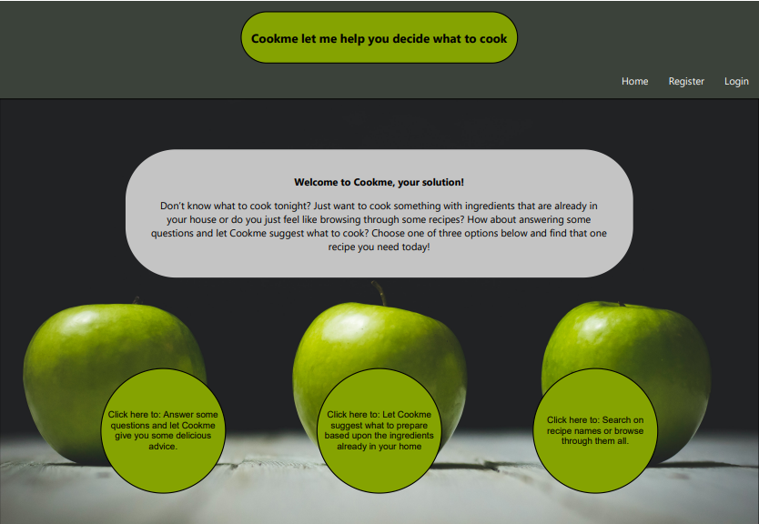

#Inleiding:

Als oplossing voor het eeuwenoude probleem dat men niet weet wat te bereiden is deze applicatie ontwikkelt.
Deze applicatie maakt het mogelijk om op drie verschillende wijze gerechten te genereren door of:

-vragen te beantwoorden waarna gerechten worden gesuggereert.

-beschikbare ingredienten in te voeren waarna gerechten worden gesuggereert.

-zelf een gerechtnaam in te voeren waarna gerechten worden gesuggereert.

Het project is opgezet met [Create React App](https://github.com/facebook/create-react-app).

De link naar de github repository betreft: https://github/Givoxs/dinner-time.

#Benodigdheden:

API key: Er is een API key nodig om informatie op te halen. Deze key is reeds ingevuld. Hier hoeft dus verder geen aandacht aan besteed te worden.

Backend deel 1: Deze applicatie maakt gebruik van de [Novi backend](https://github.com/hogeschoolnovi/novi-educational-backend-documentation/blob/main/README.md#9-errors) ten behoeve van het aanmaken van accounts en het inloggen op het eigen account.

Belangrijke informatie: De backend draait op een Heroku server. Deze server wordt automatisch inactief wanneer er een tijdje geen requests gemaakt worden. De eerste request die de server weer uit de 'slaapstand' haalt zal daarom maximaal 30 seconden op zich kunnen laten wachten. Daarna zal de responsetijd normaal zijn. Voer daarom altijd eerst een test-request uit voor je een account probeert aan te maken.

Stappenplan om de server uit de slaapstand te halen:

Deze test kun je uitvoeren op de volgende [pagina](http://localhost:3000/register) of via de link http://localhost:3000/register. De knop om de server uit de slaapstand te halen vind je onderaan de pagina. 

Open eerst de console. Druk daarna op "test server". Zodra je de response ziet in de console dat de API bereikbaar is, kan indien gewenst een account worden aangemaakt. Daarna kun je inloggen op je eigen profiel met je "username" en "password".

Backend deel 2: De informatie met betrekking tot gerechten wordt opgehaald van de Spoontacular API https://spoonacular.com/food-api/docs

#De applicatie starten
Als je het project gecloned hebt naar jouw locale machine, installeer je eerst de node_modules door het volgende commando in de terminal te runnen:

npm install

Wanneer dit klaar is, kun je de applicatie starten met behulp van:

###`npm start`

of gebruik de WebStorm knop (npm start). Open http://localhost:3000 om de pagina in de browser te bekijken. 
Bij elke wijziging zal de pagina opnieuw laden.

#Extra functionaliteiten:
### `npm test`
Start de test runner in interactieve modus. Kijk naar het volgende stuk over [tests](https://facebook.github.io/create-react-app/docs/running-tests) voor meer informatie.

### `npm run build`
Maakt de app klaar voor productie en zet dit in de `build` folder. Het bundelt React in productiemodus en optimaliseert het voor de beste prestatie.
Bekijk het volgende stuk over [deployment](https://facebook.github.io/create-react-app/docs/deployment) voor meer informatie.

## Leer meer
Je kunt meer leren via [Create React App documentation](https://facebook.github.io/create-react-app/docs/getting-started).

Om React te leren kijk je naar [React documentation](https://reactjs.org/).

